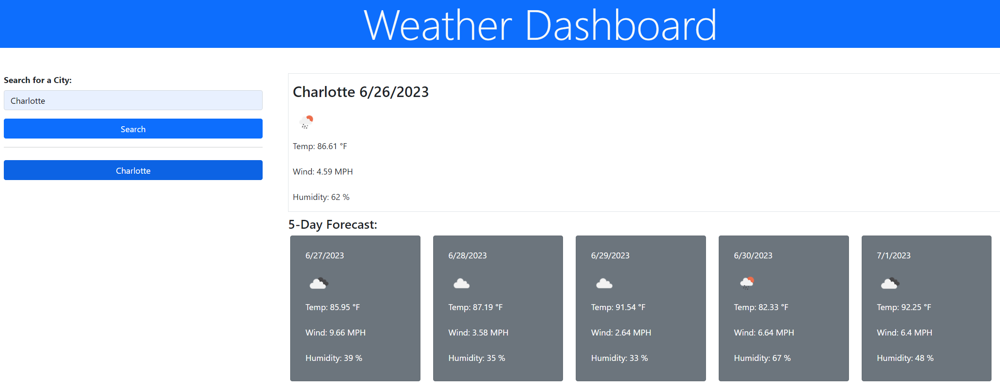

# urban-waddle-module-06-challenge
Module 06 Challenge

## Description

This web application displays the weather forecast for cities.  It allows the user to search for a city and see both the current forecast and the forecast for the next five days.  Cities that have been searched for will also be displayed as buttons in a history area so that the user can click on a button to see the forecast for a previously searched for city.

## Installation

N/A

## Usage

The application can be accessed at this URL: https://craigien.github.io/urban-waddle-module-06-challenge/

To view the weather forecast for a city, search for the city name in the search field at the top left of the screen.  The weather for that city will then be displayed.  You can also select a button with the city name in the search history area below the search.

Weather Dashboard screenshot:

## Credits

N/A

## License

N/A